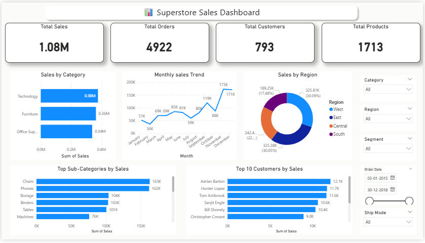

# 📊 Superstore Sales Dashboard

## 📌 Project Overview

This project is an interactive Power BI dashboard built to analyze Superstore sales data. It provides insights into sales performance, customer behavior, product categories, regional sales, and business trends through interactive visualizations.

---

## 🛠️ Tools & Technologies

- Power BI
- Power Query
- DAX
- Microsoft Excel

---

## 📊 Dashboard Preview

---

## 📈 Key Performance Indicators (KPIs)

- 💰 Total Sales: **1.08M**
- 📦 Total Orders: **4,922**
- 👥 Total Customers: **793**
- 🛍️ Total Products: **1,713**

---

## 📊 Dashboard Features

- Sales by Category
- Monthly Sales Trend
- Sales by Region
- Top 10 Customers by Sales
- Top Sub-Categories by Sales
- Interactive Filters
  - Category
  - Region
  - Segment
  - Order Date
  - Ship Mode

---

## 📂 Project Files

- Superstore_Sales_Dashboard.pbix
- Dashboard.png
- Sample_Superstore.csv
- README.md

---

## 🎯 Skills Demonstrated

- Data Cleaning
- Data Modeling
- DAX Measures
- KPI Reporting
- Interactive Dashboard Design
- Business Intelligence
- Data Visualization

---

## 👨‍💻 Author

**Deepak Singh**

⭐ If you found this project useful, please give this repository a Star.
